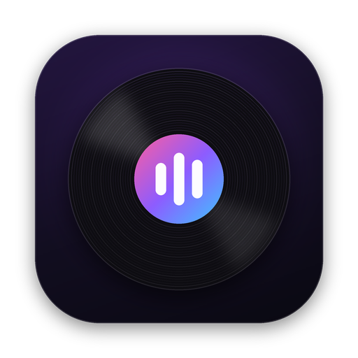
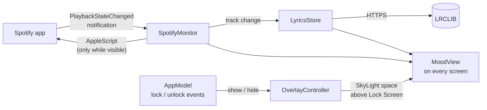

<div align="center">



# MoodPlay

**Your Spotify music, right on the Mac Lock Screen.**

Whenever your Mac is locked, MoodPlay shows the song you're playing right on the Lock Screen: the cover or a spinning vinyl, the track details, and time-synced lyrics, sitting cleanly on your wallpaper. Unlock with Touch ID as usual, and it gets out of the way.


[](https://github.com/PONDHALF/MoodPlay/releases/latest)
[](LICENSE)

</div>

---

## Contents

- [Features](#features)
- [Requirements](#requirements)
- [Installation](#installation)
- [First launch & permissions](#first-launch--permissions)
- [Usage](#usage)
- [Menu reference](#menu-reference)
- [Recommended macOS settings](#recommended-macos-settings)
- [How it works](#how-it-works)
- [Performance & battery](#performance--battery)
- [Privacy](#privacy)
- [Troubleshooting](#troubleshooting)
- [Limitations](#limitations)
- [Project structure](#project-structure)
- [Contributing](#contributing)
- [Credits](#credits)
- [License](#license)

---

## Features

| | |
|---|---|
| 🔒 **Lives on the Lock Screen** | Your music shows up on the real macOS Lock Screen. The clock, password field, and Touch ID stay exactly where macOS puts them. |
| 🖼️ **Blends with your wallpaper** | No background or overlay. Artwork and text sit directly on your Lock Screen wallpaper with a soft shadow for readability. |
| 🎯 **Smart layout** | With lyrics: artwork on the left, lyrics on the right. Without lyrics (turned off, not found, or instrumental): everything is centered. Both fit between the system clock and the unlock controls. |
| 💿 **Two themes** | **Album Cover**: the cover with the track details. **Vinyl**: a spinning record with the cover as its label and a tonearm that lifts when you pause. |
| 🎤 **Synced lyrics** | Time-synced lyrics from [LRCLIB](https://lrclib.net). The current line is highlighted and centered, and nearby lines softly blur. Instrumental breaks show animated dots. |
| 🔐 **Follows macOS locking** | Shows up however your Mac gets locked: automatically by macOS, or with **⌃⌘Q**. |
| 🖥️ **Every display** | Shows on all connected screens and adapts when displays are added or removed. |
| 🪶 **Lightweight** | Menu bar only (no Dock icon). It does no work while you're using your Mac, and animations run on Core Animation. |
| 🔑 **No login required** | No Spotify account connection and no API keys. It talks to the Spotify desktop app locally. |

---

## Requirements

- **macOS 14 Sonoma** or later
- **Spotify desktop app** (the web player isn't supported)
- **Xcode 26** or later, only if you build from source (Swift 6.2)

---

## Installation

### Option 1: Download the installer (recommended)

1. Go to the [**latest release**](https://github.com/PONDHALF/MoodPlay/releases/latest) and download **`MoodPlay-x.y.z.dmg`**.
2. Open the DMG and drag **MoodPlay** into **Applications**.
3. Open MoodPlay from **Applications**. A waveform icon appears in the menu bar.
4. In the MoodPlay menu, turn on **Open at Startup** if you want it to start with your Mac.

The app is a universal build, so it runs natively on both Apple Silicon and Intel Macs.

#### "Apple could not verify MoodPlay…" on first open

MoodPlay is open source and isn't signed with a paid Apple Developer ID, so macOS shows this warning the first time you open it. To open it anyway:

1. Try to open MoodPlay once, then click **Done** in the warning.
2. Go to **System Settings → Privacy & Security**, scroll down, and click **Open Anyway** next to the MoodPlay message.
3. Confirm with **Open Anyway** and your password or Touch ID.

You only need to do this once. If you prefer Terminal, this command does the same thing:

```bash
xattr -dr com.apple.quarantine /Applications/MoodPlay.app
```

> 🔐 Want to check the download? Every release includes a `.sha256` file:
> ```bash
> shasum -a 256 -c MoodPlay-x.y.z.dmg.sha256
> ```

#### Updating

Quit MoodPlay from its menu, download the new DMG, and replace the app in **Applications**. Because each build has its own ad-hoc signature, macOS may ask for the Spotify permission again after an update. Click **OK**.

### Option 2: Build from source

```bash
git clone https://github.com/PONDHALF/MoodPlay.git
cd MoodPlay
open MoodPlay.xcodeproj
```

1. In Xcode, select the **MoodPlay** target → **Signing & Capabilities** → choose your **Team**.
   A free Apple ID works for personal use.
2. Press **⌘R** to build and run.

### Building the installer yourself

To produce the same universal DMG that's published on the Releases page:

```bash
./scripts/build-release.sh
# → build/MoodPlay-<version>.dmg and build/MoodPlay-<version>.dmg.sha256
```

The build is ad-hoc signed by default. If you have a Developer ID certificate, pass it to create a build you can notarize:

```bash
SIGN_IDENTITY="Developer ID Application: Your Name (TEAMID)" ./scripts/build-release.sh
```

---

## First launch & permissions

MoodPlay asks for **one** permission:

| Permission | Why | When |
|---|---|---|
| **Automation → Spotify** | Reads the current track, playback position, and artwork URL from the Spotify app. | The first time Spotify is running while MoodPlay is open. |

Click **OK** when macOS asks. MoodPlay **never launches Spotify by itself**. It only talks to Spotify when Spotify is already running.

> **Denied by accident?** The menu shows a warning with a shortcut to the right settings page.
> You can also go to **System Settings → Privacy & Security → Automation → MoodPlay** and enable **Spotify**.

No Accessibility or Screen Recording permission is needed.

---

## Usage

1. Play something in Spotify.
2. Lock your Mac as usual: press **⌃⌘Q** when you get up, or let macOS lock it automatically.

   Your music fades in on the Lock Screen.
3. Come back and unlock with **Touch ID** or your password. The music screen disappears.

While music is playing, the display stays on so you can enjoy it. Pause the music and the display turns off according to your macOS settings.

> 💡 When macOS locks on its own, it usually turns the display off at the same time. Your music appears as soon as you wake the display. To keep it on screen while you're away, lock with **⌃⌘Q** instead.

---

## Menu reference

Click the **waveform** icon in the menu bar:

| Item | Description |
|---|---|
| *Now Playing* | The current track and whether it's playing or paused. |
| **Theme** | **Album Cover** or **Vinyl**. |
| **Show Lyrics** | On: artwork on the left, lyrics on the right. Off: artwork and track details centered. |
| **Open at Startup** | Open MoodPlay automatically when your Mac starts. |
| **Quit MoodPlay** | ⌘Q |

---

## Recommended macOS settings

MoodPlay doesn't have its own idle timer. It follows macOS, so automatic locking is set up in **System Settings → Lock Screen**:

- **Require password after screen saver begins or display is turned off**: **Immediately** is recommended, so your Mac is locked (and MoodPlay appears) as soon as the display turns off.
- **Turn display off when inactive** and **Start Screen Saver when inactive**: choose how long your Mac waits before locking.

MoodPlay keeps the display awake **only while it's on the Lock Screen and music is playing**. Everywhere else, your normal macOS settings apply.

---

## How it works



- **Track info** comes from the distributed notification that Spotify broadcasts on every play, pause, or skip. AppleScript is used only for the first read at launch, for the artwork URL, and to re-sync the position every 3 s while your music is on screen, in case you seek.
- **Lyrics** are fetched from LRCLIB's `/api/get`, with `/api/search` as a fallback. They're parsed from the LRC format and cached for the 40 most recent tracks.
- **Lock detection** listens for the system's lock and unlock notifications, so there's no polling or idle timer.
- **Locking** uses the same mechanism as the system's Lock Screen command, so you unlock with Touch ID or your password as usual.
- **Showing on the Lock Screen** uses a private SkyLight (WindowServer) API to create a space above the Lock Screen and place MoodPlay's windows in it. The windows ignore the mouse and keyboard, so authentication is always handled by macOS. If the API isn't available, MoodPlay still locks, just without the music screen.

---

## Performance & battery

MoodPlay is built to be close to free when you're not looking at it.

**While you're using your Mac**
- No repeating timers and no AppleScript calls. It only listens for Spotify's notifications.
- Artwork isn't downloaded, and the music screen's windows and views are destroyed so their memory is freed.
- Nothing runs while the display is asleep, the screen saver is active, or another user is logged in.

**While on the Lock Screen**
- Lyrics and the progress bar don't redraw on a fixed timer. Lyrics update only when a new line starts, and the progress bar once per second.
- There's no full-screen background to render. Artwork and text sit directly on the wallpaper.
- The vinyl record is drawn once per cover and rotated by Core Animation.
- Only the lyric lines on screen are created.

**Reliability**
- Every AppleScript call has a 2 s timeout, so a frozen Spotify can't freeze MoodPlay.
- Scripts are compiled once and reused.

---

## Privacy

- **No accounts, no analytics, no tracking.**
- Network requests go only to:
  - `lrclib.net`: the track title, artist, album, and duration, to look up lyrics
  - Spotify's image CDN: to download the current album cover
- Lyrics and artwork are kept in memory only. They're never written to disk or cached by the network layer. The only thing saved is your menu settings (UserDefaults).

---

## Troubleshooting

<details>
<summary><b>The menu says nothing is playing, but Spotify is playing</b></summary>

- Check for a permission warning in the menu and click **Open Permission Settings…**.
- Make sure you're using the Spotify **desktop app**, not the web player.
- Reset the permission and try again:
  ```bash
  tccutil reset AppleEvents me.pondhalf.moodplay.MoodPlay
  ```
  Then relaunch MoodPlay and play a track. macOS will ask again.
</details>

<details>
<summary><b>macOS says MoodPlay "can't be opened" or "could not be verified"</b></summary>

This is expected for apps without a paid Developer ID. See [first open instructions](#apple-could-not-verify-moodplay-on-first-open).
</details>

<details>
<summary><b>My Mac never locks on its own</b></summary>

Automatic locking is controlled by macOS, not MoodPlay. See [Recommended macOS settings](#recommended-macos-settings). You can always lock right away with **⌃⌘Q**.
</details>

<details>
<summary><b>The Mac locks, but no music shows on the Lock Screen</b></summary>

- Make sure Spotify has a track loaded. MoodPlay only shows up when there's something to show.
- A macOS update may have changed the private API MoodPlay uses for the Lock Screen. Please [open an issue](https://github.com/PONDHALF/MoodPlay/issues) with your macOS version.
</details>

<details>
<summary><b>"Lyrics not found for this song"</b></summary>

LRCLIB is a free, community-maintained database, and some tracks aren't in it yet. You can contribute lyrics at [lrclib.net](https://lrclib.net).
</details>

<details>
<summary><b>Two waveform icons in the menu bar</b></summary>

Two copies are running, for example one from Xcode and one from Applications. Quit one of them.
</details>

<details>
<summary><b>The new app icon doesn't show in Finder or System Settings</b></summary>

macOS caches icons. Run:
```bash
killall iconservicesagent Dock
```
Then reopen System Settings.
</details>

---

## Limitations

- **Lock Screen display relies on a private macOS API** (SkyLight). It works on macOS 14 through 27, but a future macOS update could break it. If that happens, MoodPlay still locks your Mac, just without the music screen.
- **Spotify desktop only.** Apple Music and other players aren't supported yet.
- **Not on the Mac App Store.** MoodPlay needs App Sandbox off to talk to Spotify, and it uses a private macOS API to show on the Lock Screen.
- **Lyrics quality** depends on LRCLIB's community data.

---

## Project structure

```
MoodPlay/
├── MoodPlayApp.swift        # App entry, menu bar menu, AppModel (settings, lock/sleep handling),
│                            # themes
├── SpotifyMonitor.swift     # Spotify notifications + AppleScript, playback anchor, artwork loading
├── LyricsStore.swift        # LRCLIB client, LRC parser, lyrics cache, shared HTTP session
├── OverlayController.swift  # Lock Screen space (SkyLight), windows per screen, screen lock, power assertion
├── MoodView.swift           # Lock Screen UI: cover / vinyl, progress, lyrics, adaptive layout
├── MoodPlay.entitlements    # Apple Events automation entitlement
└── plan.md                  # Original design plan (Thai)
scripts/
└── build-release.sh         # Universal build + DMG installer
```

---

## Contributing

Issues and pull requests are welcome. Before opening a PR:

1. Build with **Swift 6 language mode**. The project should compile with no concurrency warnings.
2. Keep the performance principles above: no work while hidden, and no per-frame SwiftUI updates for things Core Animation can do.
3. Describe how you tested it (Spotify playing or paused, single or multiple displays, macOS version).

Ideas on the roadmap: Apple Music support, more themes (e.g. a visualizer), and text colors picked from the album art.

---

## Credits

- Lyrics by **[LRCLIB](https://lrclib.net)**, a free and open synced-lyrics database.
- The Lock Screen technique is based on **[SkyLightWindow](https://github.com/Lakr233/SkyLightWindow)** by Lakr Aream (MIT).
- Built with SwiftUI, AppKit, and Core Animation.

> MoodPlay isn't affiliated with, endorsed by, or connected to Spotify AB.
> "Spotify" is a trademark of Spotify AB.

---

## License

MoodPlay is released under the [MIT License](LICENSE). You're free to use, modify, and share it, as long as you keep the copyright notice.

<div align="center">
<sub>Made by <a href="https://github.com/PONDHALF">PONDHALF</a></sub>
</div>
